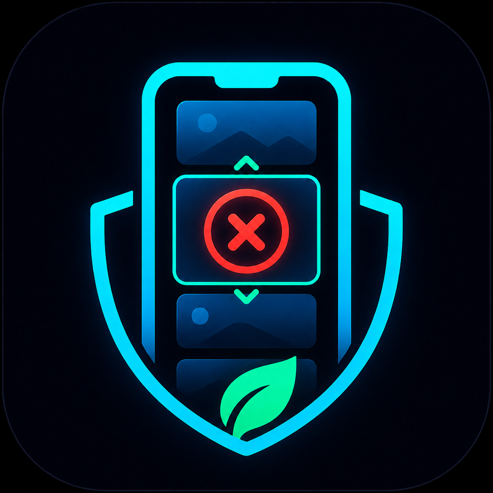

<p align="center">
  
</p>

<h1 align="center">AwayDoomscrollin'</h1>

<p align="center">
  <strong>Break the Infinite Scroll Loop — For Good.</strong><br/>
  Open-source, privacy-first Android accessibility shield for Instagram Reels, TikTok & YouTube Shorts.<br/>
  🌐 <strong><a href="https://awaydoomscrollin.com">awaydoomscrollin.com</a></strong>
</p>

<p align="center">
  <a href="https://github.com/resolvecommunity/AwayDoomscrollin/releases/latest"></a>
  <a href="https://www.gnu.org/licenses/gpl-3.0"></a>
  <a href="https://developer.android.com"></a>
  <a href="https://gitlab.com/fdroid/fdroiddata/-/merge_requests/45081"></a>
  <a href="https://www.virustotal.com/gui/file/e2f85493d47f12a64bc8c3877440adf8f9190641aba512dfa5fb08a553842b99"></a>
  
</p>

---

## 🎯 What is it?

**AwayDoomscrollin'** is an open-source Android digital wellbeing utility designed to interrupt compulsive short-video doomscrolling before it drains your focus.

Unlike standard screen-time limiters that lock you out of entire applications, AwayDoomscrollin' operates with surgical precision:
- **Blocks the trap**: Interrupts algorithmic short-feed loops (**Instagram Reels**, **TikTok For You**, and **YouTube Shorts**).
- **Preserves utility**: Leaves intentional spaces (**DMs**, **user profiles**, **comments**, **search**, and **long-form educational videos**) completely open and accessible.

Everything runs on-device using Android's native **Accessibility Service** (`canRetrieveWindowContent`). It evaluates view routes in memory to identify distraction feeds without capturing screenshots, logging keystrokes, or exfiltrating private personal data.

---

## ✨ Features (v1.1.0)

| Feature | Description |
|---|---|
| ⚡ **Surgical Feed Shield** | Instantly detects and interrupts short-video feeds (Reels, TikTok, Shorts) with mindful pause screens. |
| 💬 **DM Safe Zone** | Smart bypass rules ensure you can reply to friends and manage private messages without triggering the blocker. |
| 🎨 **Modern Vector UI** | Over 50 custom-crafted scalable Android XML vector icons for sharp rendering across all displays. |
| 🪶 **Featherlight Build** | Completely stripped of heavy simulator assets for a tiny APK size and minimal storage footprint. |
| 🛡️ **Privacy-First Core** | 100% on-device screen analysis. No screen recording, no background task tampering, and zero keylogger heuristics. |
| 🚨 **Anti-Cheat Mind Barrier** | Psychological friction screen that prompts conscious reflection before impulsively disabling shields. |
| 🏆 **Gamification & Tiers** | Daily streaks, XP accumulation, 100% Focus Score tracker, and 12 motivational achievement tiers. |
| 🕒 **24-Hour Heatmap** | Visual hourly breakdown of interruptions so you can identify and conquer your peak vulnerability hours. |
| 📊 **Impact Dashboard** | Real-time analytics tracking reclaimed minutes and per-platform distraction distribution. |

---

## 📱 Supported Platforms

| Platform | Target Package | Protected Route | Available Safe Zones | Status |
|---|---|---|---|---|
| **Instagram** | `com.instagram.android` | Reels Feed & Viewer | Direct Messages (DMs), User Profiles, Settings, Comments | 🟢 Active |
| **TikTok** | `com.zhiliaoapp.musically` | For You & Following Feeds | User Profiles, Settings, Search | 🟢 Active |
| **YouTube** | `com.google.android.youtube` | Shorts Feed & Pivot Tabs | Long-form Videos, Subscriptions, Search, Library | 🟢 Active |

---

## 📥 Installation

- **Direct APK (Recommended)**: Download the verified release binary from [GitHub Releases](https://github.com/resolvecommunity/AwayDoomscrollin/releases/latest).
- **F-Droid**: Inclusion request in progress ([Merge Request 45081](https://gitlab.com/fdroid/fdroiddata/-/merge_requests/45081)).
- **Google Play Store**: Official store release coming soon.

---

## 🚀 Building from Source

### Prerequisites
- Android Studio Ladybug / Jellyfish or newer
- Android SDK 34 / 35, Build Tools 34.0.0+
- JDK 17 / Kotlin 1.9+

### Quick Start

```bash
# 1. Clone the repository
git clone https://github.com/resolvecommunity/AwayDoomscrollin.git
cd AwayDoomscrollin

# 2. Build the signed or debug APK
# On Linux / macOS:
./gradlew assembleRelease

# On Windows (PowerShell / CMD):
.\gradlew.bat assembleRelease
```

The compiled APK will be located at `app/build/outputs/apk/release/app-release-unsigned.apk`.

---

## 🔒 Privacy & Network Boundaries

AwayDoomscrollin' believes in radical transparency regarding permissions and network boundaries:

1. **On-Device Core Analysis**:
   - The Accessibility Service evaluates UI window hierarchies strictly in-memory.
   - It **does not** take screenshots, record screens, read keystrokes (`canRequestFilterKeyEvents` is disabled), or tamper with other running processes (`KILL_BACKGROUND_PROCESSES` is purged).
2. **Internet Permission (`android.permission.INTERNET`)**:
   - The manifest declares `INTERNET` access exclusively for two specific purposes:
     - **Optional Opt-In Telemetry**: Disabled by default. No data or UUID is created until the user explicitly enables it. If enabled, it only transmits pseudonymous aggregate stats (streak days, block counts, device model, app version) with a 24-hour rate limit. No personal identifiers (IMEI, MAC, Android ID, Ad ID) are ever accessed.
     - **Dynamic Rule Updates**: Periodically fetches non-executable JSON detection rules (`rules.json`) from GitHub to adapt to third-party app UI updates without requiring full APK updates. Cached for 6 hours.
3. **No Third-Party Trackers**:
   - Zero commercial ad SDKs, zero Google Analytics, zero Firebase, zero third-party tracking libraries.
   - Read our complete [Privacy Policy](https://awaydoomscrollin.com/privacy).

---

## 🛡️ Security & Vulnerability Reporting

Security and user trust are our highest priorities. If you discover a potential vulnerability, please consult [SECURITY.md](SECURITY.md) for responsible disclosure procedures. We commit to acknowledging reports within 72 hours and addressing verified issues within 14 days.

---

## 🤝 Contributing

We welcome community contributions, bug reports, and rule improvements! Please review [CONTRIBUTING.md](CONTRIBUTING.md) before submitting pull requests.

---

## 📄 License

Distributed under the **GNU General Public License v3.0** (GPLv3).  
See the [LICENSE](LICENSE) file for details.

<p align="center">
  Crafted with care by <a href="https://resolvecommunity.com">Resolve Community</a>
</p>
