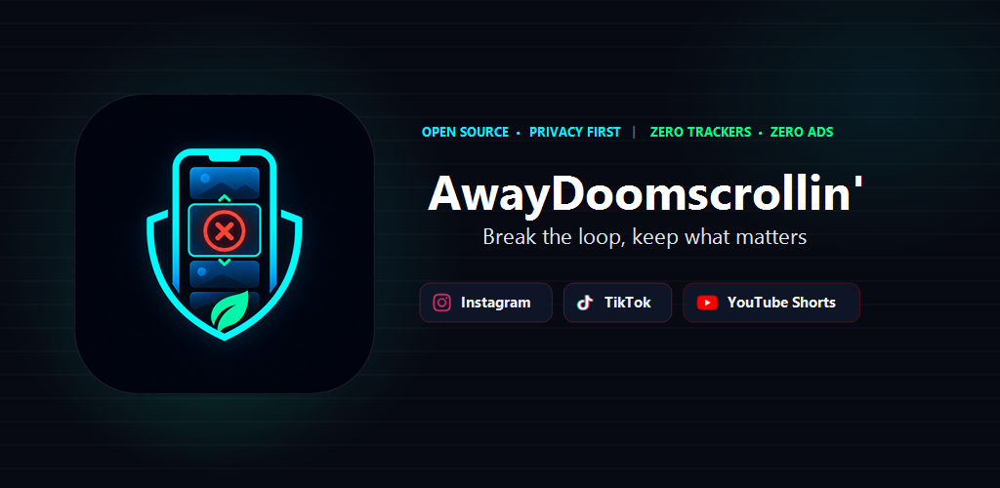

<p align="center">
  
</p>

<h1 align="center">AwayDoomscrollin'</h1>

<p align="center">
  <strong>Set clearer boundaries for short-content feeds.</strong><br/>
  Open-source, privacy-first Android accessibility shield for Instagram Reels, TikTok & YouTube Shorts (Beta).<br/>
  🌐 <strong><a href="https://awaydoomscrollin.com">awaydoomscrollin.com</a></strong>
</p>

<p align="center">
  <a href="https://github.com/resolvecommunity/AwayDoomscrollin/releases/latest"></a>
  <a href="https://www.bestpractices.dev/projects/14458"></a>
  <a href="https://github.com/ResolveCommunity/AwayDoomscrollin/actions/workflows/codeql.yml"></a>
  <a href="https://www.gnu.org/licenses/gpl-3.0"></a>
  <a href="https://developer.android.com"></a>
  
  <a href="https://www.virustotal.com/gui/file/e2f85493d47f12a64bc8c3877440adf8f9190641aba512dfa5fb08a553842b99"></a>
  
</p>

<p align="center">
  
</p>

---

## 🎯 What is it?

**AwayDoomscrollin'** is an open-source Android digital wellbeing utility designed to interrupt unwanted short-video scrolling and help users keep the boundaries they choose.

Unlike screen-time limiters that impose minute budgets or daily quotas, AwayDoomscrollin' works on **behavior, not clocks**: it interrupts the *chain* — the endless swipe loop — while keeping single pieces of content and everyday social features reachable.

- **Interrupts the chain, not the single video**: a deliberately opened Short or TikTok video can be watched to the end; the swipe toward the *next* one is where protection kicks in.
- **Keeps socializing available**: Instagram messaging, profile information, Stories and Search, TikTok inbox/DMs/profile/search/comments, and normal YouTube videos stay usable.
- **No time limits, no quotas, no lockouts**: nothing counts your minutes or locks the app. Protected media grids (including menu collections like Saved, Likes and Reposts) are exited on entry instead.

Everything runs on-device using Android's native **Accessibility Service** (`canRetrieveWindowContent`). It evaluates view routes in memory to identify distraction feeds without capturing screenshots, logging keystrokes, or exfiltrating private personal data.

---

## ✨ Features

| Feature | Description |
|---|---|
| ⚡ **Behavior-Based Shield** | No minute budgets or daily quotas. Instagram Home/Explore are covered in place and Reels are exited; TikTok and YouTube Shorts chains are interrupted on the first swipe toward the next video. |
| 🎬 **Single Videos Stay Watchable** | A deliberately opened Short or TikTok video can be watched to its end — the endless chain is what gets closed, not the content itself. |
| 💬 **Social Safe Zones** | Instagram DMs/Stories/profile/Search, TikTok inbox/DMs/profile/search/comments and normal YouTube videos remain usable while protected media is interrupted. |
| 🧭 **Focused Intervention** | Instagram profile chrome (menu, banner editor, Threads shortcut, highlight picker) is released on tap so allowed surfaces never draw under the shield. Routine blocks are silent. |
| 🎨 **Modern Vector UI** | Over 50 custom-crafted scalable Android XML vector icons, edge-to-edge dark theme, bilingual Turkish/English interface with in-app language switch. |
| 🪶 **Lean Build** | Uses Android and Compose components without advertising or analytics SDKs. |
| 🛡️ **Privacy-First Core** | Accessibility screen analysis is handled in memory on-device. The app does not record the screen or request key-event filtering. |
| 🏆 **Streaks & Achievements** | Keeps local daily protection streaks and optional achievement progress. |
| 🕒 **Peak Hour Insight** | Identifies your single most vulnerable hour of the day and intervention count directly on the home dashboard. |
| 📊 **Impact Dashboard** | Local analytics showing per-platform interventions and measured Instagram protection time. |

---

## 📱 Supported Platforms

| Platform | Interrupted | Stays Available | Status |
|---|---|---|---|
| **Instagram**<br/>`com.instagram.android` | Home feed & Explore grid (covered in place), Reels viewers (including from DMs/profiles/links), profile & message-detail media grids, menu collections (Saved, Likes, Reposts) | Stories, Direct Messages, profile information & chrome (menu, banner editor, Threads shortcut), highlight picker, Search | 🔶 Beta |
| **TikTok**<br/>`com.zhiliaoapp.musically` | For You & Friends feeds (first vertical swipe exits), fullscreen video watch chains, Following & Community top-tab entries (snapped back) | Browsing, Inbox & DMs, profiles (visits, follows, messaging), Search, comments — the opened video stays watchable to the end | 🔶 Beta |
| **YouTube**<br/>`com.google.android.youtube` | Shorts chain: the first swipe toward the next video closes the viewer | A deliberately opened Short watched to the end, long-form videos, Subscriptions, Search, comments | 🔶 Beta |

> All platform integrations are currently in **Public Beta**. They are functional on tested configurations but may require rule adjustments following third-party app layout updates.

---

## 📥 Installation

- **Direct APK**: Download the signed public-beta binary from [GitHub Releases](https://github.com/resolvecommunity/AwayDoomscrollin/releases/latest).
- **F-Droid** (planned)
- **Google Play** (planned)

### 📖 Sideloading & Android 13+ Setup Guide

When installing an open-source APK with an Accessibility Service directly on **Android 13, 14, 15+** (Samsung One UI, Google Pixel, Xiaomi HyperOS/MIUI, etc.), Android and Google Play Protect require two simple permissions:

1. **Google Play Protect Warning / Block**:
   - Because AwayDoomscrollin' provides an Accessibility Service and is installed outside the Play Store, Google Play Protect may flag or block the installation.
   - If Play Protect offers **"More details"**, tap **"Install anyway"** (*"Yine de yükle"*).
   - If Play Protect **strictly blocks the APK** with no override button: Open **Google Play Store ➔ tap your Profile icon (top right) ➔ Play Protect ➔ Settings gear (⚙️) ➔ temporarily disable "Scan apps with Play Protect"**, install the APK, and then re-enable it. *(AwayDoomscrollin' is 100% open-source, contains zero third-party trackers or ads, and is verified 0/70 Clean on VirusTotal).*
2. **Restricted Settings ("Kısıtlanmış Ayar")**: Android restricts Accessibility for sideloaded apps by default. If the switch in Accessibility is greyed out:
   - Long-press the **AwayDoomscrollin'** icon on your home screen and tap **App Info (ⓘ)** (or go to *Settings > Apps > AwayDoomscrollin'*).
   - Tap the **three dots (⋮)** in the top-right corner.
   - Select **"Allow restricted settings"** (*"Kısıtlanmış ayarlara izin ver"*) and confirm with your device PIN or fingerprint.
   - Return to *Accessibility* and toggle the service on.

> 🌐 **Step-by-Step Web Guides**:
> - 🇬🇧 **English Guide**: [awaydoomscrollin.com/en/guide](https://awaydoomscrollin.com/en/guide)
> - 🇹🇷 **Türkçe Rehber**: [awaydoomscrollin.com/tr/rehber](https://awaydoomscrollin.com/tr/rehber)

---

## 🚀 Building from Source

### Prerequisites
- Android Studio Meerkat 2024.3.1 Patch 1 or newer
- Android SDK 36, Build Tools 35.0.0+
- JDK 17 / Kotlin 1.9+

### Quick Start

```bash
# 1. Clone the repository
git clone https://github.com/resolvecommunity/AwayDoomscrollin.git
cd AwayDoomscrollin

# 2. Build the debug APK
# On Linux / macOS:
./gradlew assembleDebug

# On Windows (PowerShell / CMD):
.\gradlew.bat assembleDebug
```

The debug APK is written to `app/build/outputs/apk/debug/app-debug.apk`. Release APK/AAB tasks intentionally fail unless a release or Play upload key and its matching environment variables are configured.

---

## 🔒 Privacy & Network Boundaries

AwayDoomscrollin' believes in radical transparency regarding permissions and network boundaries:

1. **On-Device Core Analysis**:
   - The Accessibility Service evaluates UI window hierarchies strictly in-memory.
   - It **does not** take screenshots, record your screen, or log keystrokes.
   - Before Android Accessibility Settings can open, the app shows a separate disclosure with “Agree and open settings” and “Not now” choices. Declining leaves protection off and does not lock the app.
2. **Internet Permission (`android.permission.INTERNET`)**:
   - The manifest declares `INTERNET` access for one optional purpose:
     - **Optional Usage Data (v2 only)**: Disabled by default. The switch opens a separate detailed confirmation before the first report; cancelling creates no telemetry UUID or request. If enabled, it transmits a random installation ID; aggregate intervention counts and measured Instagram protection time; device model and screen metrics; and Android, AwayDoomscrollin', Instagram, TikTok and YouTube version information with a 24-hour attempt limit. Streak and XP are not transmitted. No personal identifiers (IMEI, MAC, Android ID, Ad ID) are accessed.
   - Core protection and detection logic run entirely on-device; internet access is never used for protection decisions.
3. **No Third-Party Trackers**:
   - The current Android app does not include commercial advertising, Google Analytics, Firebase, or third-party tracking SDKs.
   - Read our complete [Privacy Policy](https://awaydoomscrollin.com/privacy).

---

## 🛡️ Security & Vulnerability Reporting

Security reports are welcome. If you discover a potential vulnerability, please consult [SECURITY.md](SECURITY.md) for the responsible disclosure process.

---

## 🤝 Contributing

We welcome community contributions, bug reports, and rule improvements! Please review [CONTRIBUTING.md](CONTRIBUTING.md) before submitting pull requests.

---

## 📄 License

Distributed under the **GNU General Public License v3.0** (GPLv3).  
See the [LICENSE](LICENSE) file for details.

<p align="center">
  Crafted with care by <a href="https://resolvecommunity.com">Resolve Community</a>
</p>
